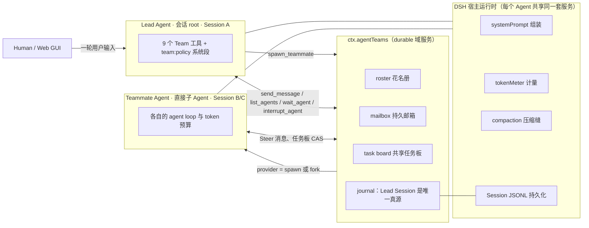
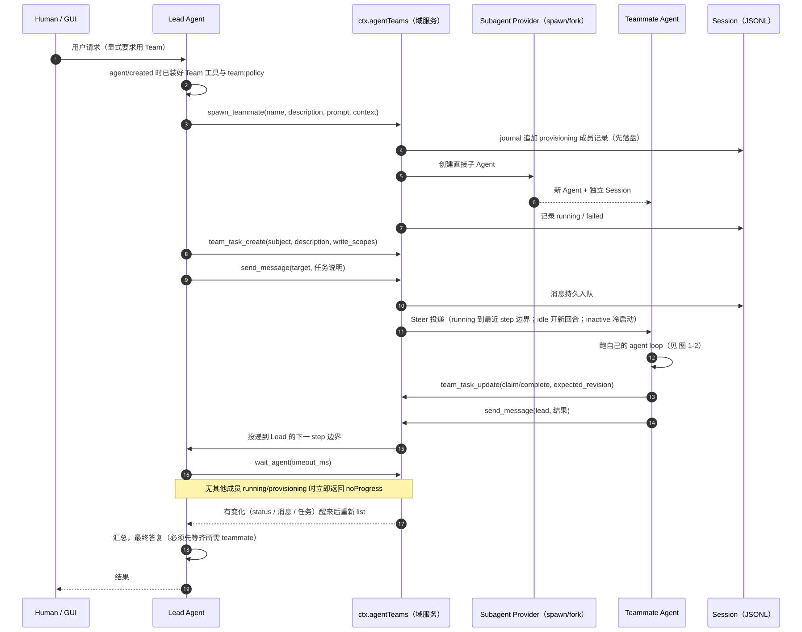
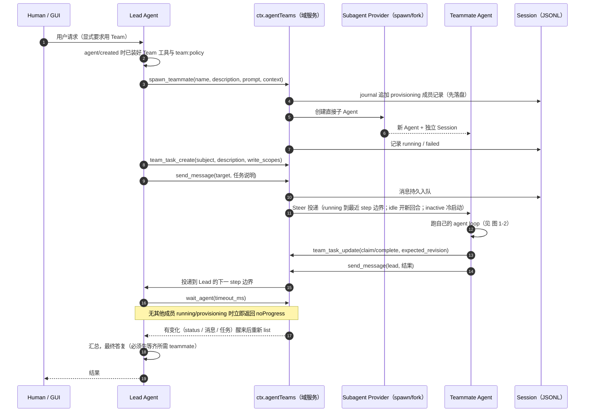
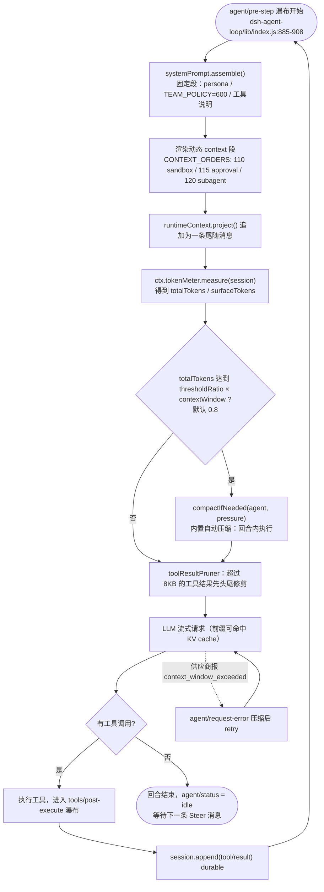
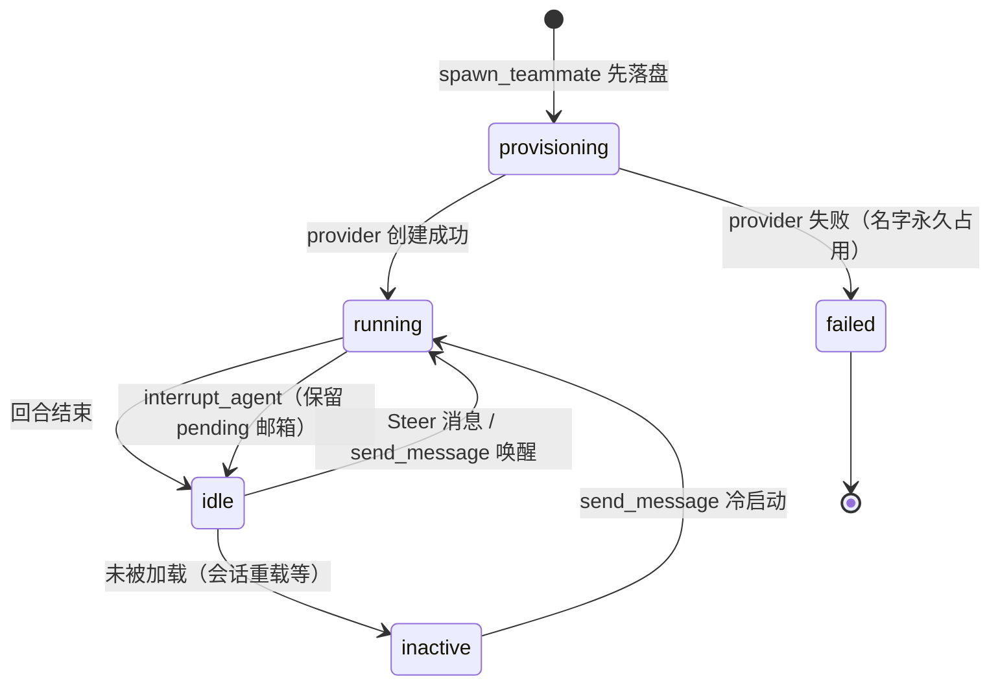

# DSH Agent Team 工作流程（现状）

> 依据：本机安装的 DeepSeek Harness 0.1.5-rc.2 源码（每条机制都带 文件:行号，见文末证据表）
> 配套文档：加入里程碑压缩系统后的新流程见 DSH-Team-工作流图-里程碑压缩.md
> Mermaid 图可直接渲染；每张图后附 ASCII 版与说明表。

---

## 图 1-0 总览：谁是谁



<details><summary>Mermaid 源码（可复制去渲染/改图）</summary>



</details>


**ASCII 版**

````
┌──────────────────────── Human / Web GUI ─────────────────────────┐
│  用 Agent Teams 把任务拆给两个人                                   │
└───────────────────────────────┬──────────────────────────────────┘
                                │ 一轮用户输入（turn）
                                ▼
┌──────────────── Lead Agent（会话 root，Session A）───────────────┐
│ 挂载即装工具：spawn_teammate / send_message / list_agents /       │
│              wait_agent / interrupt_agent / team_task_*（共 9 个）│
│ 并注入 systemPrompt.section("team:policy")                        │
└──────────┬───────────────────────────────────────▲──────────────┘
           │ ①spawn_teammate                        │ ④roster/mailbox/
           │ ②team_task_create                      │   task 变化
           ▼                                        │
┌──────────────────── ctx.agentTeams（durable 域服务）─────────────┐
│  roster（provisioning→running/idle/inactive/failed）              │
│  mailbox（消息先持久入队，再尝试投递；不丢不重）                    │
│  task board（CAS 版本 + blocked_by 依赖 DAG + write_scopes 警告）  │
│  journal：全部状态从 Lead Session 日志回放                        │
└──────────┬───────────────────────────────────────┬──────────────┘
           │ ③provider = spawn | fork               │ ⑤Steer 投递
           ▼                                        ▼
┌──────────── Teammate Agent（独立 Session B/C）───────────────────┐
│ 自己跑 agent loop：读文件 / 改代码 / 跑测试 / 用共享工作目录       │
│ 有独立的上下文窗口与 token 预算                                    │
│ 回合结束 → status = idle → 等下一条消息被唤醒                      │
└──────────────────────────────────────────────────────────────────┘
        ▲                                                        ▲
        └────── 每个 Agent 共用同一套宿主服务 ────────────────────┘
             systemPrompt 组装 · tokenMeter 计量 · compaction 压缩缝 · Session JSONL
````

---

## 图 1-1 协作时序：从用户拆任务到 Lead 答复



<details><summary>Mermaid 源码（可复制去渲染/改图）</summary>



</details>


**ASCII 版**

````
用户 ──请求──► Lead ──spawn_teammate──► agentTeams ──provider──► Teammate
                 │            │                                    │
                 │            └─ journal：provisioning→running      │
                 │                                                 │
                 ├──team_task_create / send_message──► mailbox ──Steer──►（idle 则开新回合）
                 │
                 │            ┌───────── Teammate 干完一段 ─────────┐
                 │            │ team_task_update(claim/complete)      │
                 │            │ send_message(lead, 结果)              │
                 │            └──────────────┬───────────────────────┘
                 │                           ▼
                 ├──wait_agent ◄──── 状态 / 消息 / 任务板的变化事件
                 │   （没有活跃同伴则立刻 noProgress，提醒先用 send_message 唤醒）
                 ▼
            汇总并给出最终答复（必须先等齐所有必需的 teammate）
````

---

## 图 1-2 单个 Agent 的一步：上下文流水线（新方案要插入钩子的地方）



<details><summary>Mermaid 源码（可复制去渲染/改图）</summary>



</details>


**ASCII 版**

````
              ┌──────────────── agent/pre-step 瀑布 ────────────────┐
              │ 1. systemPrompt.assemble()                          │
              │    固定段：harness 身份 / persona / TEAM_POLICY=600 │
              │ 2. 动态 context 段（sandbox=110 approval=115 …）    │
              │ 3. project() 作为一条尾随消息追加到本次请求          │
              └───────────────────────┬─────────────────────────────┘
                                      ▼
                         tokenMeter.measure(session)
                                      │
                     totalTokens ≥ 0.8 × contextWindow ?
                          ├── 否 ──► 继续
                          └── 是 ──► compactIfNeeded  ← 内置自动压缩
                                      （回合中途就能压，不需要 idle）
                                      ▼
                        toolResultPruner（超过 8KB 的结果先修剪）
                                      ▼
                          LLM 流式请求（前缀命中 KV cache）
                                      ▼
                          有工具调用？─是─► 执行，进入 tools/post-execute
                               │                    │
                               └─否─► 回合结束       └─► session.append(tool/result)
                                        status=idle ──► 回 pre-step 继续下一步
````

**现状的三个要点（决定新方案能做什么）**

1. 内置自动压缩阈值是 **0.8 × contextWindow**（本机 1,000,000 即 800k），且是**回合中途**触发；不存在“100k 就压”的行为。
2. “系统提示”有三条缝：systemPrompt.section（冻结前缀）、systemPrompt.context（每步重算的尾随消息）、agent/pre-step 瀑布里追加的 plugin 消息。新方案用后两条：不动前缀、不破坏 KV cache。
3. 每个 Team 成员（Lead 与 teammate）跑的是**同一套** agent loop，共享同一批宿主服务，只是 Session 与上下文预算互相独立。

---

## 图 1-3 成员状态与消息投递规则



<details><summary>Mermaid 源码（可复制去渲染/改图）</summary>



</details>


| 目标状态 | send_message 的行为 |
|---|---|
| running | 在**最近的 step 边界**投递（Steer） |
| idle | 立刻开一个新回合 |
| inactive | 冷启动后再投递 |
| 任何状态 | 结果 accepted 或 queued；queued 已持久，禁止重发 |

---

## 附录：证据索引（本机 0.1.5-rc.2）

| 机制 | 文件:行号 |
|---|---|
| Team 工具按成员作用域安装 / agent/created / tryMembership | ~/.dsh/profiles/desktop/node_modules/@deepseek-ai/dsh-experimental-tool-agent-team/lib/index.js:231-245, 526-547 |
| team:policy 系统段 + 9 个工具 schema | 同上 :9-27 |
| TeamMembership / membership / tryMembership | .../dsh-experimental-agent-team/lib/types/roster.d.ts:11-16, 47, 53 |
| Team profile patch（insert 两行 + 关闭重名全局行） | .../dsh-experimental-agent-team-profile/cordis.patch.yml |
| agent/pre-step 瀑布契约（messages 追加点） | .../dsh-agent-loop/lib/index.js:885-908 |
| agent.status：maintenance 也报 idle | 同上 :773-776 |
| runMaintenance（非 idle 抛错、结束后唤醒闩住消息） | 同上 :805-828 |
| followup/steer/inject 语义 | 同上 :783-797 |
| TokenMeter.measure 返回结构 | .../dsh-token-meter/lib/index.js:608-686 |
| 压力口径 input+cacheRead+cacheWrite | 同上 :389-396 |
| ctx.compaction / ManualCompactionError | .../dsh-compaction/lib/index.js:149-176 |
| /compact 调 compactNow(agent, signal, commandId) | .../dsh-command-compact/lib/index.js:48-71 |
| 默认 thresholdRatio=0.8 / retainRatio=0.16 | .../dsh-compaction-basic/lib/index.js:15-17 |
| 自动压缩钩子（pre-step 压力 + request-error 溢出） | 同上 :793-847 |
| compactNow 走 runMaintenance、要求 idle | 同上 :944-970 |
| 压缩产物 compacted-summary 八段模板 | 同上 :211-257, 323-335 |
| SECTION_ORDERS（TEAM_POLICY=600）/ CONTEXT_ORDERS(110/115/120) | .../dsh-system-prompt/lib/index.js:10-47 |
| section/context/variable/getSectionOrder/getContextOrder | 同上 :238-266 |
| systemPrompt.context() 实用例（sandbox / approval） | .../dsh-sandbox-policy/lib/index.js:121-130；.../dsh-user-approval/lib/index.js:79-89 |
| plugin source 一次性消息（form: notice） | .../dsh-repeat-tool-reminder/lib/index.js:1377-1380, 1483-1512 |
| 本机模型 contextWindow = 1,000,000 | ~/.dsh/settings.yaml:1507-1512 |
| 本机 profile patch（maxMembers:30、insert MCP 行） | ~/.dsh/profiles/desktop/cordis.patch.yml |
