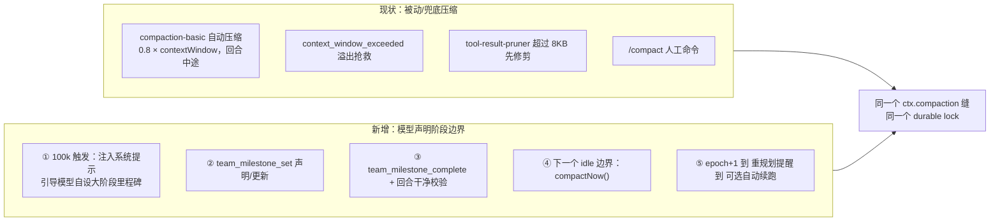
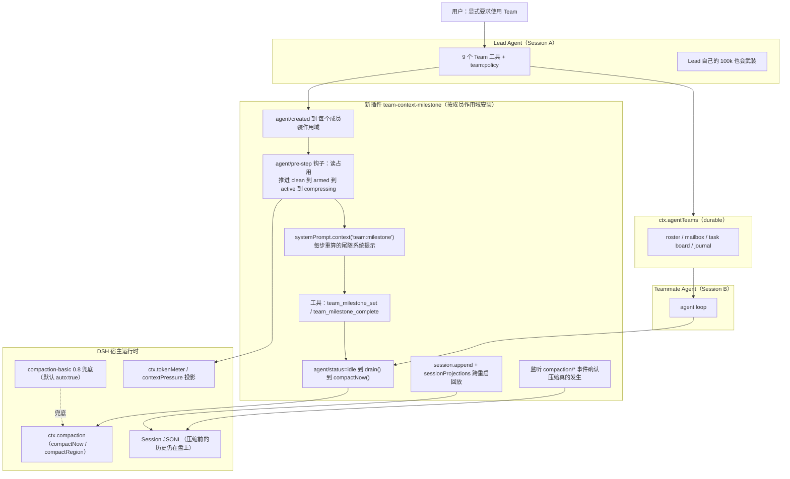
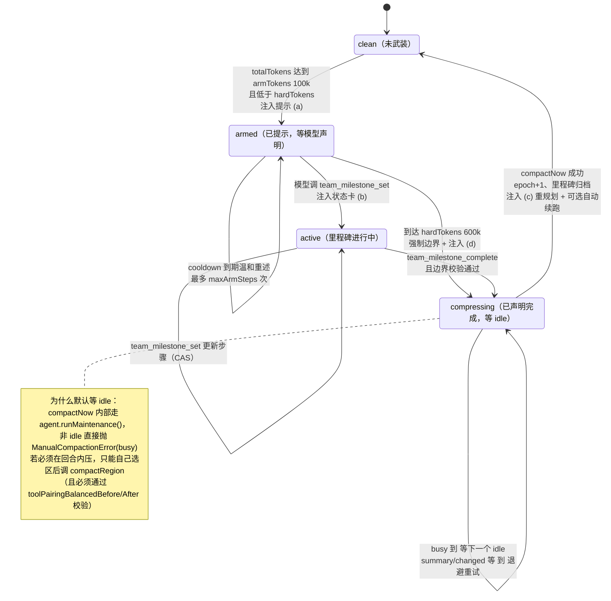
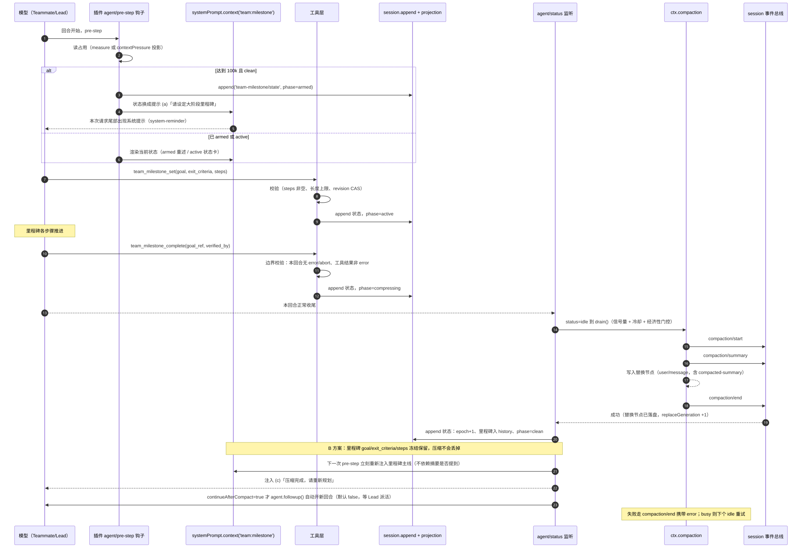
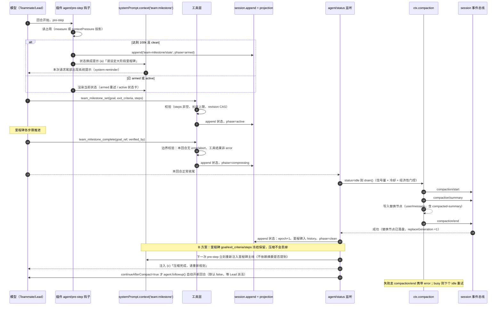
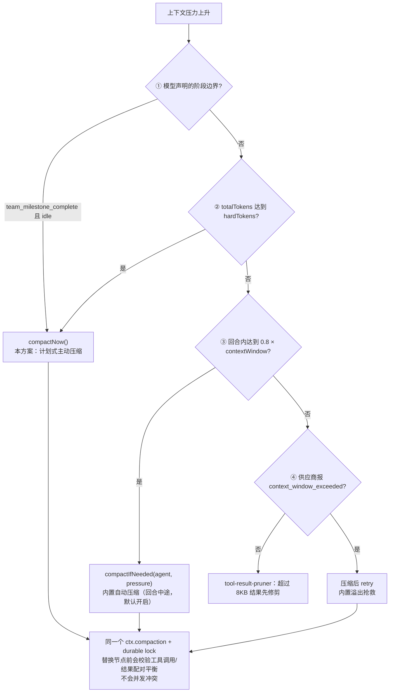

# DSH Agent Team 工作流程（加入里程碑压缩系统后）

> 现状版见 DSH-Team-工作流图-现状.md。本文只画“新流程”。
> 机制依据来自本机 0.1.5-rc.2 源码 + 一次独立的压缩子系统复核（结论已并入，见文末证据索引）。
> Mermaid 图可直接渲染，每张图后附 ASCII 版与说明表。

---

## 图 2-0 新增了什么：计划式主动压缩



<details><summary>Mermaid 源码（可复制去渲染/改图）</summary>



</details>


**范式（借鉴 NVlabs/SoL-Pi 的 Online Context Compact）**：模型只负责“声明阶段边界”，压不压、何时压由 harness 决定；压完要求模型重新规划。

DSH 与 Pi 的三个关键差异（决定了实现形态）：

| 维度 | SoL-Pi（Pi harness） | DSH 0.1.5-rc.2 |
|---|---|---|
| 边界怎么来 | update_plan 的某一步变 completed | 本方案新增 team_milestone_set/complete |
| 能否回合中途压 | 可以，先 abort 当前回合再压 | 强制入口 compactNow 要求 idle；但 compactRegion 可在回合内压（需自行选区） |
| 压完怎么继续 | 隐藏 triggerTurn 消息自动开新回合 | agent.followup() 可等价实现 |
| 完成信号 | agent_settled | 可监听 session 事件 compaction/start、compaction/summary、compaction/end |

---

## 图 2-1 新流程总览：Team 协作 + 里程碑压缩



<details><summary>Mermaid 源码（可复制去渲染/改图）</summary>



</details>


**ASCII 版**

````
┌──────────────── Human / GUI ────────────────┐
│ 用 Team 做这件事                              │
└───────────────────────┬─────────────────────┘
                        ▼
┌──────────── Lead Agent（Session A）──────────────────────────────┐
│ Team 协作（同现状）  +  自己的里程碑状态机（100k 也会武装）        │
└───────┬────────────────────────────────────┬────────────────────┘
        │ spawn_teammate                     │ send_message / wait
        ▼                                    ▼
┌──── ctx.agentTeams（durable）───┐   ┌──── Teammate Agent（Session B）────┐
│ roster/mailbox/task/journal     │◄─►│ 自己的 agent loop + 自己的里程碑    │
└─────────────────────────────────┘   └──────────────┬─────────────────────┘
                                                     │
   新插件 team-context-milestone（每个成员一份作用域） │
   ┌─────────────────────────────────────────────────▼──────────────────┐
   │ agent/pre-step 钩子：                                              │
   │   占用读法：ctx.tokenMeter.measure(session).totalTokens              │
   │            （更省：ctx.sessionProjections.stateOf(session,           │
   │              'contextPressure') 得到 pressureTokens/contextWindow）  │
   │        ≥ 100k 且 clean ──► armed（注入“请设定大阶段里程碑”）         │
   │        ≥ hardTokens ────► compressing（强制边界 + 一次性告警）      │
   │ 系统提示走 systemPrompt.context()：每步重算的尾随消息，前缀不变       │
   │ 工具：team_milestone_set（声明/更新步骤）                            │
   │       team_milestone_complete（声明阶段完成，需回合干净）            │
   │ agent/status = idle ──► drain() ──► ctx.compaction.compactNow()      │
   │ 完成确认：监听 session 事件 compaction/start → summary → end         │
   │ 状态持久化：session.append + sessionProjections（可跨重启回放）      │
   └────────────────────────────────────────────────────────────────────┘
                                     │
                        ┌────────────▼─────────────┐
                        │ 内置 compaction-basic 0.8 │ ← 兜底（默认开启）
                        └──────────────────────────┘
````

---

## 图 2-2 成员里程碑状态机（新）



<details><summary>Mermaid 源码（可复制去渲染/改图）</summary>



</details>


**ASCII 版**

````
                totalTokens ≥ armTokens(100k)                     team_milestone_set
   ┌────────┐ ─────────────────────────────► ┌────────┐ ─────────────────────────► ┌────────┐
   │ clean  │     注入(a)：请设定大阶段里程碑    │ armed  │      注入(b)：里程碑状态卡      │ active │
   └────────┘ ◄───────────────────────────── └────────┘ ◄───────────────────────── └────────┘
        ▲              （cooldown 到期温和重述）    │                                  │
        │                                          │ hardTokens(600k) 强制边界         │ team_milestone_complete
        │                                          ▼                                  │ + 回合干净校验
        │                                   ┌──────────────┐                          │
        │        compactNow 成功             │ compressing  │ ◄────────────────────────┘
        │        epoch+1 / 里程碑归档         │  （等 idle）  │
        └────────────────────────────────────└──────────────┘
                      注入(c)：重规划提醒 + 可选 followup 自动续跑
                      busy → 下一个 idle 重试；summary/changed/… → 退避 + 告警 Lead
                      确认压缩成功：监听会话事件 compaction/start → summary → end
````

---

## 图 2-3 一次“阶段完成到自动压缩”的端到端时序（新）



<details><summary>Mermaid 源码（可复制去渲染/改图）</summary>



</details>


**ASCII 版**

````
模型           pre-step钩子        systemPrompt.context     工具层         session(durable)      agent/status(idle)   compaction
 │                  │                       │                 │                  │                    │                 │
 │──回合开始───────►│                       │                 │                  │                    │                 │
 │                  │─读占用（measure 或 contextPressure）      │                  │                    │                 │
 │                  │  达到100k 且 clean     │                 │                  │                    │                 │
 │                  │──append(phase=armed)──────────────────────────────────────►│                    │                 │
 │                  │──换成提示(a)──────────►│                 │                  │                    │                 │
 │◄────────────本次请求尾部出现 system-reminder────────────────│                  │                    │                 │
 │──team_milestone_set(goal,exit_criteria,steps)────────────►│                  │                    │                 │
 │                  │                       │                 │──校验 + CAS       │                    │                 │
 │                  │                       │                 │──append(active)──►│                    │                 │
 │   …推进各步骤…                                                                                                          │
 │──team_milestone_complete(goal_ref,verified_by)────────────►│                  │                    │                 │
 │                  │                       │       边界校验：回合无 error/abort │                    │                 │
 │                  │                       │                 │──append(compressing)─────────────────►│                 │
 │──回合正常收尾──────────────────────────────────────────────────────────────────►│──status=idle──────►│                 │
 │                  │                       │                 │                  │                    │──drain()───────►│
 │                  │                       │                 │                  │                    │  信号量/冷却/门控 │
 │                  │                       │                 │◄────compaction/start → summary → end────│ 写替换节点       │
 │                  │                       │                 │◄──成功: epoch+1、清里程碑、clean─────────│                 │
 │                  │                       │                 │  里程碑 goal/验收条件/步骤 冻结保留（B方案） │                 │
 │◄────下一次 pre-step 重新注入里程碑主线，再叠加 (c)「压缩完成，请重新规划」────────│  followup 续跑默认关闭            │
 │                  │                       │                 │                  │                    │                 │
 │     若长期 busy 或到达 0.8×contextWindow：compaction-basic 在回合中途兜底压缩（默认 auto:true）                          │
````

---

## 图 2-4 四条压缩路径的分工（避免互相踩踏）



<details><summary>Mermaid 源码（可复制去渲染/改图）</summary>



</details>


| 路径 | 触发 | 执行时机 | 归属 | 默认开 |
|---|---|---|---|---|
| ① 计划式主动压缩 | 模型声明阶段完成 | idle 边界 | 本方案 | 是（装了就开） |
| ② 强制边界 | 100k 提示长期无响应，达 600k | idle 边界 | 本方案 | 是 |
| ③ 自动兜底 | 达到 0.8 × contextWindow | 回合中途 | compaction-basic | 是（auto:true） |
| ④ 溢出抢救 | 供应商报窗口超限 | 请求失败后 | compaction-basic | 是 |
| ⑤ 结果修剪 | 单个工具结果超过 8KB | 压缩前 | tool-result-pruner | 是 |

---

## 图 2-5 新旧流程对照

| 环节 | 现状 | 新流程 |
|---|---|---|
| 100k 时的行为 | 无反应（默认阈值 800k） | 注入 system-reminder，引导模型自设大阶段里程碑 |
| 谁决定压缩点 | 没人 / 固定比例 | 模型声明阶段边界，harness 决策 |
| 压缩执行时机 | 回合中途（0.8×window） | 下一个 idle 边界（不打断工具链） |
| 压缩后 | 直接继续 | 注入“重规划”提醒 + 可选自动续跑 |
| 状态 | 无 | 里程碑/epoch 持久在 Session，可跨重启回放 |
| 完成确认 | 无 | 监听 compaction/start、summary、end 会话事件 |
| 经济性 | 无 | 阶段 2：SoL-Pi 式 breakeven 门控 + 窗口保护旁路 |
| 前缀缓存 | 稳定 | 保持稳定：提示走尾随 context；DeepSeek 路由声明 systemPromptUpdate=in-history，即使动 system prompt 也只追加一条 system/message 节点 |
| 兜底 | 0.8×window 自动压缩 | 不变 |

---

## 插入点速查表（新插件要用的真实 API）

| 用途 | API / 位置 |
|---|---|
| 给每个 Team 成员装作用域 | ctx.agentTeams.tryMembership(agent) + ctx.agents.list() + ctx.on('agent/created')，参照 tool-agent-team/lib/index.js:526-547 |
| 成员身份 | ctx.agentTeams.membership(agent) 得到 root/id/role/name |
| 读上下文占用 | ctx.tokenMeter.measure(session).totalTokens / surfaceTokens；更省可读 ctx.sessionProjections.stateOf(session,'contextPressure') 得到 pressureTokens/contextWindow/projectedTokens |
| 每步钩子 | agent.ctx.on('agent/pre-step', ({agent,turn,step,signal}, next) => …)，契约见 dsh-agent-loop:885-908 |
| 注入常驻系统提示 | agent.ctx.systemPrompt.context({name:'team:milestone', order:130, text:(assembly)=>…})（CONTEXT_ORDERS 目前最大是 SUBAGENT_DELEGATION=120） |
| 注入一次性提醒 | 在 pre-step 瀑布里往 downstream.messages 追加一条 source={kind:'plugin',plugin:'team-context-milestone',form:'notice'} 的消息；或 tools/post-execute 返回 additionalContexts |
| 提醒文案风格 | dsh-agent-instructions 的 system-reminder 标签约定（含闭合标签转义） |
| 声明/完成工具 | agent.ctx.tools.register(defineTool({...}))，参照 tool-agent-team 的 9 个工具写法 |
| 触发压缩 | ctx.compaction.compactNow(agent, signal, sourceCommandId)（需 idle，返回 CompactionResult 或 null）；回合内强压可自己选区调 ctx.compaction.compactRegion(start,end,agent,signal)，但必须保证工具调用/结果配对平衡（toolPairingBalancedBefore/After，validateSurfaceRegion 会拒绝不平衡切点） |
| 压缩结果 | { compactionId, sourceCommandId?, startSeq, summarySeq, endSeq, summary[], shadowedRange{start,end}, shadowedSeqs[], shadowedTokenCount }；成功要求摘要严格小于被遮挡部分 |
| 完成/失败信号 | 会话事件 compaction/start（含 compactionId/turn）、compaction/summary、compaction/end（失败时 end 带 error）；ctx.on('session/event', …) 即可观测 |
| 失败码 | ManualCompactionError.code ∈ busy / cancelled / changed / summary / commit / persistence |
| 状态持久化 | agent.session.append('team-milestone/state', {...}) + ctx.sessionProjections.register({key,stateVersion,stateSchema,init,apply}) |
| 自动续跑 | agent.followup(input)（入队 + 唤醒）；只入队不唤醒用 agent.inject(input) |
| 挂载 | profile 的 cordis.patch.yml 里 - insert: [{id, name, config}]；新包要先进 profile package.json 的 dependencies 与 dsh.profile.bundles |

---

## 附录：证据索引（本机 0.1.5-rc.2）

| 机制 | 文件:行号 |
|---|---|
| Team 工具与 team:policy 按成员作用域安装 | ~/.dsh/profiles/desktop/node_modules/@deepseek-ai/dsh-experimental-tool-agent-team/lib/index.js:231-245, 526-547 |
| TeamMembership / membership / tryMembership | .../dsh-experimental-agent-team/lib/types/roster.d.ts:11-16, 47, 53 |
| agent/pre-step 瀑布契约与默认 messages 追加 | .../dsh-agent-loop/lib/index.js:885-908 |
| agent.status：maintenance 也报 idle | 同上 :773-776 |
| runMaintenance 非 idle 抛错、结束后唤醒闩住消息 | 同上 :805-828 |
| followup / steer / inject 语义 | 同上 :783-797 |
| TokenMeter.measure 返回结构；totalTokens 口径 | .../dsh-token-meter/lib/index.js:608-686, 643-686, 682 |
| contextPressure 投影 pressureTokens/contextWindow/projectedTokens | .../dsh-token-meter/lib/types/usage-projection.js:48-58, 141-187 |
| 投影状态读取 | .../dsh-session-projection/lib/index.js:127-132 |
| ctx.compaction 抽象服务 | .../dsh-compaction/lib/types/index.js:44-47 |
| ManualCompactionError 与失败码 | .../dsh-compaction/lib/types/index.js:21-34；.../dsh-command-compact/lib/index.js:18-45 |
| compactIfNeeded / compactNow / compactRegion | .../dsh-compaction-basic/lib/index.js:873-920, 944-970, 930-935 |
| compactNow 要求 idle（runMaintenance） | 同上 :944-970，尤其 :967-969 |
| CompactionResult 字段 | 同上 :633-653 |
| 自动压缩钩子（pre-step / status / session 事件 / request-error） | 同上 :793-847 |
| 默认配置（thresholdRatio 0.8、retainRatio 0.16、maxTokens 8192、compactionRetries 1、maxOverflowRetries 1、auto true） | 同上 :15-17, :30-34, :58-78 |
| 只接受比例、无绝对 thresholdTokens | 同上 :108-125, :111 |
| 工具配对平衡校验（切点合法性） | .../dsh-compaction/lib/types/tool-pairing.js:9-18, 82-95；.../dsh-compaction-basic/lib/index.js:533-549 |
| 替换节点为 user/message，含 compacted-summary | .../dsh-compaction-basic/lib/index.js:567-570, 621-632；:211-212, 257, 323-335 |
| 压缩会话事件 compaction/start / summary / end | 同上 :452, 467, 478-481, 605-620 |
| 压缩前历史仍在盘上、回放一致 | .../dsh-compaction/README.zh.md:12, :95 |
| surfaceOp replace 与 replaceGeneration | .../dsh-session/lib/types/surface.js:164-173, 370-377, 437-446 |
| session.append(type,data,opts) | .../dsh-session/lib/types/index.js:555-599 |
| systemPrompt.section / context / variable / orders | .../dsh-system-prompt/lib/index.js:10-47, 238-266, 336-343 |
| 作用域：loop 以 agent 为 scope 组装 | .../dsh-agent/lib/index.js:258-264；.../dsh-agent-loop/lib/index.js:890 |
| systemPromptUpdate=in-history（改动只追加 system/message） | .../dsh-llm/lib/index.js:2057-2058；.../dsh-llm-deepseek/lib/index.js:1849, 1882；.../dsh-agent-loop/lib/index.js:274-283 |
| system-reminder 标签约定与转义 | .../dsh-agent-instructions/lib/index.js:111-112, 127-129, 784-795, 1270-1288 |
| 挂载点（token-meter / compaction-basic / command-compact / tool-result-pruner） | .../dsh-base/cordis.patch.yml:317-326, 394-399 |
| 本机模型 contextWindow = 1,000,000 | ~/.dsh/settings.yaml:1507-1512 |

外部参考：NVlabs/SoL-Pi <https://github.com/NVlabs/SoL-Pi>（Online Context Compact）· 论文 <https://arxiv.org/abs/2609.20519>
